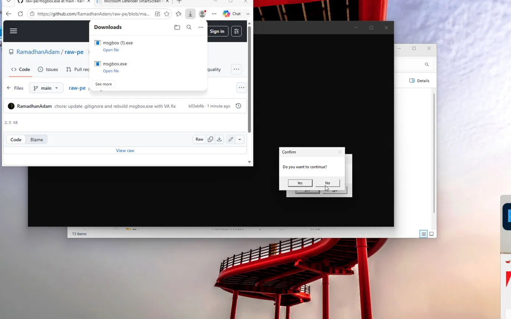
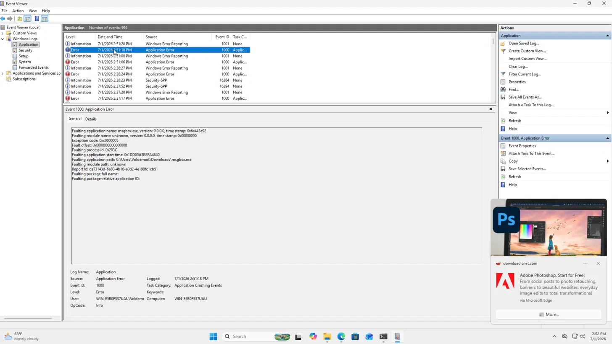
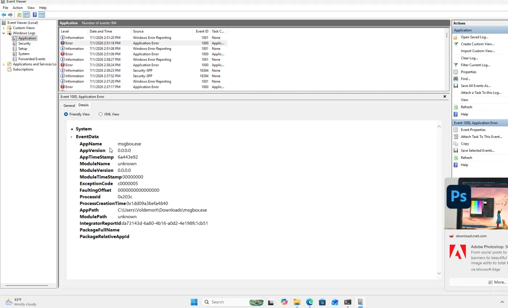
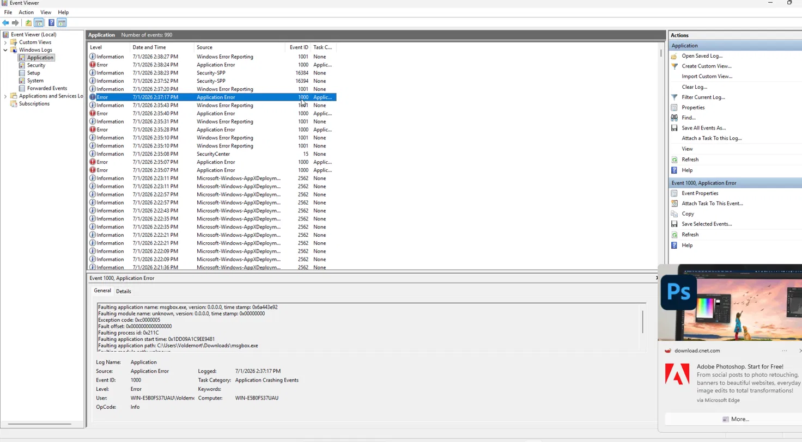
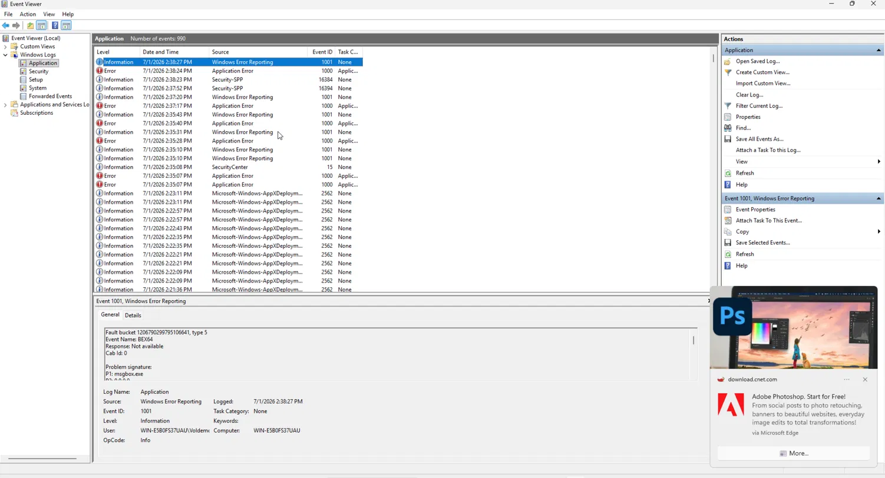

# raw-pe
I decided to create this Windows PE from scratch in order to understand in depth how Windows PE(Portable Executables) files work and how they are created. This helps me for malware analysis.

## What this is 

A Win64 GUI executable, hand-assembled byte-by-byte with NASM — every DOS
header field, NT header field, section header, and import table entry
written manually, no linker.
 
It shows a Yes/No `MessageBoxA` ("Do you want to continue?") and exits with
code `0` (Yes) or `1` (No).

## Build
 
```bash
nasm -f bin msgbox.asm -o msgbox.exe
```

Requires NASM. Output should be exactly 2560 bytes (0xA00)

## Run
Copy `msgbox.exe` to a Windows machine or VM and run it:
 
```powershell
.\msgbox.exe
```
 
Click Yes/No, then check the exit code:
```powershell
$LASTEXITCODE   # 0 = Yes, 1 = No
```
 
If PowerShell returns immediately without waiting (common for GUI-subsystem
processes), use:
```powershell
Start-Process -FilePath .\msgbox.exe -Wait
$LASTEXITCODE
```

⚠️ This is an unsigned, hand-built binary — Windows SmartScreen will flag it as
uncommon. That's expected for any new unsigned executable; only run it in a VM
or sandbox you control if you're not comfortable trusting it directly.

## Build log (the short version)
 
Roughly 30 commits over 3 days, going from a blank DOS header to a working
executable with real import resolution. The early commits were mostly NASM
syntax errors and PE structural-math mistakes; the last one was a genuine
runtime addressing bug that took real debugging to root-cause (see the full
walkthrough below).
 
| Stage | Issue | Fix |
|---|---|---|
| DOS/COFF/Optional headers | — | built field by field, byte-counted by hand |
| Data directories | malformed `dd x, dd y` syntax | one `dd` per value |
| `.text` | NASM defaulted to 16-bit mode | added `bits 64` directive |
| `.idata` | `SizeOfImage` didn't cover `.idata`'s VA range | extended `SizeOfImage` |
| `.idata` | `SizeOfInitializedData` excluded `.idata` | included it in the sum |
| Section headers | `SizeOfHeaders`/`PointerToRawData` stale after adding the `.idata` header | recalculated offsets |
| `.text` | literal typo, `call[rel ...]` missing a space | added the space |
| `.text` → `.idata`/`.data`/`.bss` | **the big one** — `[rel label]` computed with flat file-offset deltas instead of RVA deltas across sections | absolute VA math, full writeup below |
 
Full commit history: [github.com/RamadhanAdam/raw-pe/commits/main](https://github.com/RamadhanAdam/raw-pe/commits/main)
 
## Debugging walkthrough: the 0xc0000005 crash
 
### Symptom
 
First "working" build compiled clean, sized correctly, and passed PE-bear
inspection — but launching it produced no dialog. Nothing. Silent failure.
 
### Step 1 — check if it's actually running
 
```powershell
.\msgbox.exe
$LASTEXITCODE
```
 
Empty output. No window, no exit code. This told me the process was either
exiting instantly or crashing before I could observe anything from PowerShell
(GUI-subsystem processes detach immediately, so `$LASTEXITCODE` alone wasn't
enough — I switched to `Start-Process -Wait` to actually block on it).
 
### Step 2 — Event Viewer
 
Checked **Event Viewer → Windows Logs → Application** for the crash event.
The first entry found was a `Windows Error Reporting` event (ID 1001, type
`BEX64` — a generic "buffer/exception overflow" bucket Windows uses when it
can't classify a crash more precisely):
 

 
Right next to it was the more useful `Application Error` (Event ID 1000)
with the actual exception details:
 

 
```
Faulting application name: msgbox.exe
Exception code: 0xc0000005      (access violation)
Fault offset: 0x0000000000000000
Faulting module name: unknown
```
 
`Fault offset 0x0` + `module unknown` was the key clue: this isn't a crash
*inside* a recognizable function — it's the CPU jumping to address `0x0`
outright. That's consistent with calling through a null/garbage pointer.
 
### Step 3 — root cause
 
My `.text` code called imported functions like this:
 
```asm
call [rel user32_iat]
```
 
`[rel label]` is RIP-relative addressing. NASM's `-f bin` output has no
concept of sections — it computes every relative offset as a flat **file
byte delta**. That's accurate *within* one section, but my sections are laid
out differently on disk (`FileAlignment = 0x200`) than they will be in memory
(`SectionAlignment = 0x1000`). So a reference from `.text` (file offset
`0x400`, RVA `0x1000`) to `.idata` (file offset `0x800`, RVA `0x4000`) has a
*file* delta of `0x400` but a *runtime* delta of `0x3000` — completely
different numbers. NASM baked in the wrong one, so the `call` landed on
whatever garbage happened to be at the miscalculated address — in this case,
effectively `0x0`.
 
### Step 4 — fix
 
Replaced every cross-section symbolic reference with an absolute 64-bit VA,
computed manually as `ImageBase + section_RVA + intra_section_offset`, loaded
with `mov reg, imm64` and dereferenced with `call [reg]`:
 
```asm
; before (broken — file-offset delta != runtime RVA delta)
call [rel user32_iat]
 
; after (correct — absolute VA, computed at assemble time)
mov rax, 0x140000000 + 0x4000 + (user32_iat - idata_start)
call [rax]
```
 
Intra-section symbolic math (e.g. `import_dir - idata_start`, both inside
`.idata`) was safe to leave as-is, since file-offset delta and RVA delta
agree when both labels live in the same section.
 
### Step 5 — verified
 
Reassembled, redeployed, reran:
 

 
Dialog appeared, exit code matched Yes/No correctly.
 
### A follow-up scare: intermittent crash
 
After the fix, I hit the *same* `0xc0000005` crash again on a later run:
 


 
Checking `AppTimeStamp` in Event Viewer's Details tab against my PE header's
`TimeDateStamp` confirmed it *was* the current fixed binary crashing — not a
stale copy. Two working hypotheses:
 
1. **Most likely:** I had two files in Downloads (`msgbox.exe` and a leftover
   `msgbox (1).exe` from an earlier download) and accidentally ran the old
   one.
2. **Worth flagging regardless:** this binary has no `.reloc` section and
   hardcodes absolute VAs against a fixed `ImageBase` (`0x140000000`). If
   Windows ever can't map the image at that exact preferred base and silently
   relocates it, every hardcoded VA in `.text` would point to stale
   addresses — which would produce exactly this symptom, and exactly this
   intermittently, depending on system memory conditions at load time.
Deleted the duplicate file, reran several times cleanly with no recurrence —
consistent with hypothesis #1. Documenting hypothesis #2 here anyway, since
adding a `.reloc` section (or explicitly handling non-preferred-base loads)
is the correct long-term fix and something I'd want to address before
trusting this binary's addressing under memory pressure.
 
## Known limitations
 
- No `.reloc` section — the binary is only guaranteed to work if the loader
  can map it at its preferred `ImageBase` (`0x140000000`). No ASLR support.
- No error handling if either DLL/import fails to resolve.
- Written for learning, not for production use of any kind.
## License
 
MIT — see [LICENSE](LICENSE).